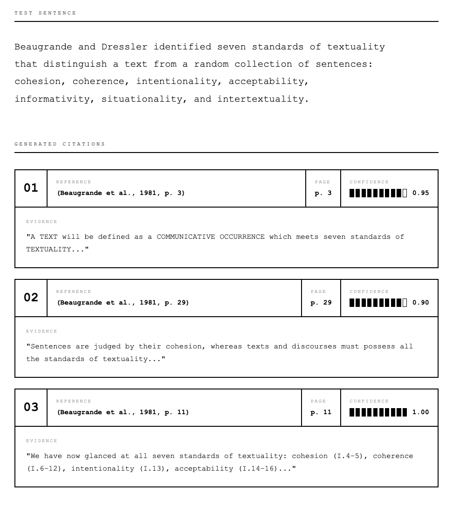

<div align="center">

# Scholaris

### **AI-Powered Academic Citation System**

[](https://python.org)
[](LICENSE)
[](https://github.com/joseluissaorin/scholaris)

**Automatically cite your academic writing with verified page numbers and intelligent attribution.**

Vision OCR · Page-Aware RAG · Temporal Logic · Framework Detection · Shareable .spdf Format

[Get Started](#-quick-start) · [Auto-Citation](#-auto-citation-system) · [.spdf Format](#-shareable-spdf-format)

</div>

---

<br/>

## What Makes Scholaris Different

Other tools help you *organize* references. Scholaris **automatically inserts citations into your writing** with real, verified page numbers—and understands when older theories are being applied to modern concepts.

<table>
<tr>
<td width="50%" valign="top">

### The Problem

You write: *"Beaugrande's textuality standards apply to how tokenizers segment language model input."*

Now you need to:
- Find which paper supports this claim
- Realize Beaugrande (1981) predates neural NLP
- Rewrite to show you're *applying* his framework
- Hunt through a 50-page PDF for the right page
- Format the citation correctly

</td>
<td width="50%" valign="top">

### The Solution

Scholaris detects temporal impossibilities and rewrites for proper attribution:

*"Applying the textuality framework of Beaugrande and Dressler (1981), we can analyze how tokenizers segment language model input."* **(Beaugrande et al., 1981, p. 3)**

- **Temporal logic** — detects anachronistic citations
- **Framework rewrites** — proper attribution for theory application
- **Page numbers verified** via Vision OCR

</td>
</tr>
</table>

<br/>

---

<br/>

## New in v1.1: Intelligent Citation Logic

### Citation Type Classification

Every citation is classified into one of four types:

| Type | Description | Example |
|------|-------------|---------|
| **DIRECT_SUPPORT** | Source directly makes this claim | "Attention is all you need" (Vaswani, 2017) |
| **FRAMEWORK_APPLICATION** | Applying older theory to new domain | Using Halliday (1976) to analyze Transformers |
| **BACKGROUND_CONTEXT** | General domain knowledge | Foundational linguistics concepts |
| **TEMPORAL_IMPOSSIBLE** | Source predates the concept | Citing 1981 paper for "BERT architecture" |

### Automatic Framework Rewrites

When you cite an older theory for a modern concept, Scholaris rewrites for proper attribution:

**Before (problematic):**
> La tokenización influye en la «intencionalidad simulada» del modelo. (de Beaugrande, 1981, p. 84)

**After (properly attributed):**
> Partiendo del marco de de Beaugrande y Dressler (1981), donde la intencionalidad es un estándar de textualidad, podemos analizar cómo la tokenización influye en la «intencionalidad simulada» del modelo. (de Beaugrande, 1981, p. 84)

### Language-Aware Quotation Marks

Automatically detects document language and uses appropriate quotation marks:

| Language | Style | Example |
|----------|-------|---------|
| Spanish | Guillemets (no space) | «texto citado» |
| French | Guillemets (with space) | « texte cité » |
| English | Double quotes | "cited text" |

<br/>

---

<br/>

## New in v1.3: Hybrid Metadata Extraction & Bibliography Export

### Hybrid Metadata Extraction

Extract accurate bibliographic metadata from PDFs using an intelligent hybrid approach:

| Method | Description | Confidence |
|--------|-------------|------------|
| **pdf2bib** | DOI/ISBN lookup from PDF metadata | Highest (0.9) |
| **Gemini Vision** | OCR of title pages | High (0.85) |
| **PDF internal metadata** | Embedded PDF fields | Medium (0.4) |
| **Filename parsing** | Extract from filename patterns | Low (0.3) |

Results are intelligently merged with higher confidence sources taking precedence.

```bash
# CLI: Extract metadata from all PDFs in a directory
scholaris extract ./pdfs -o bibliography.xlsx
scholaris extract ./pdfs -o refs.bib --format bibtex

# Process PDF with auto-metadata extraction
scholaris process paper.pdf --auto-metadata
```

### Bibliography Export

Export your bibliography to multiple formats:

| Format | Command | Use Case |
|--------|---------|----------|
| **Excel** | `scholaris export ./spdf refs.xlsx` | Review, share with collaborators |
| **BibTeX** | `scholaris export ./spdf refs.bib --format bibtex` | LaTeX integration |
| **CSV** | `scholaris export ./spdf refs.csv --format csv` | Spreadsheet import |
| **JSON** | `scholaris export ./spdf refs.json --format json` | Programmatic access |

### Python API

```python
from scholaris.auto_cite.metadata_extractor import (
    HybridMetadataExtractor,
    BibliographyExporter,
    batch_extract_metadata,
)

# Extract metadata from PDFs
results = batch_extract_metadata(
    pdf_paths=["paper1.pdf", "paper2.pdf"],
    gemini_api_key=API_KEY,
)

# Export to various formats
BibliographyExporter.to_xlsx(results, "bibliography.xlsx")
BibliographyExporter.to_bibtex(results, "references.bib")
```

<br/>

---

<br/>

## New in v1.2: Cross-Lingual & Improved Matching

### Cross-Lingual Citation Matching

Documents in one language can now cite sources in another language seamlessly:

- **Spanish document + English sources** — semantic matching across languages
- **Language metadata** — each .spdf file stores its detected language (ISO 639-1)
- **Automatic detection** — language inferred from text content during processing

**Example:**
> Spanish claim: "La cohesión léxica conecta elementos textuales"
> English evidence: "Lexical cohesion creates connections between textual elements"
> → Correctly matched and cited!

### Improved Markdown Handling

Citations now work correctly with markdown-formatted text:

| Pattern | Example | Status |
|---------|---------|--------|
| Italics around words | `*Centering*` | ✓ Matched |
| Italics around phrases | `*in silico*` | ✓ Matched |
| Bold text | `**important**` | ✓ Matched |
| Mixed formatting | `«sujeto *in silico*»` | ✓ Matched |

### Text Corruption Fix

Framework application rewrites now correctly calculate replacement boundaries, preventing mid-word insertions like `"altern (citation)as"`.

<br/>

---

<br/>

## Auto-Citation in Action

<div align="center">



*Your text → AI matches claims to sources → Verified page numbers with confidence scores*

</div>

<br/>

**Before:**
> Beaugrande and Dressler identified seven standards of textuality that distinguish a text from a random collection of sentences: cohesion, coherence, intentionality, acceptability, informativity, situationality, and intertextuality.

**After:**
> Beaugrande and Dressler identified seven standards of textuality that distinguish a text from a random collection of sentences: cohesion, coherence, intentionality, acceptability, informativity, situationality, and intertextuality. **(Beaugrande et al., 1981, p. 3)**

<br/>

---

<br/>

## Core Features

<table>
<tr>
<td width="50%" valign="top">

### Vision OCR + Page-Aware RAG
- **Scanned PDF support** — OCR extracts text from images
- **Real page numbers** — reads printed page numbers, not PDF indices
- **Landscape detection** — handles double-page book scans
- **Roman numerals** — front matter (i, ii, xii) supported

### Grounded Citations
- **No guessing** — page numbers come from retrieval, not hallucination
- **Confidence scores** — 0.0-1.0 reliability rating per citation
- **Evidence tracking** — see exactly what text matched each claim
- **CSV/JSON export** — full audit trail for verification

</td>
<td width="50%" valign="top">

### Intelligent Attribution
- **Temporal detection** — catches anachronistic citations
- **Framework rewrites** — proper attribution when applying theories
- **Citation classification** — DIRECT_SUPPORT vs FRAMEWORK_APPLICATION
- **Language detection** — Spanish/French/English quotation styles

### Shareable .spdf Format
- **Process once, use forever** — no re-processing needed
- **Single portable file** — share with colleagues instantly
- **Contains everything** — OCR text, embeddings, page metadata
- **Recovery features** — export previews if original PDF lost

</td>
</tr>
</table>

<br/>

---

<br/>

## Auto-Citation System

### Basic Usage with CitationIndex

```python
from scholaris.auto_cite import CitationIndex, CitationStyle

# Load from a bibliography folder containing .spdf or .pdf files
index = CitationIndex.from_bibliography(
    folder="./bibliography/",
    gemini_api_key="your-key",
    auto_process=True,   # Process new PDFs automatically
    save_processed=True  # Save as .spdf for future use
)

print(f"Loaded {len(index)} sources, {index.total_chunks} chunks")

# Generate citations with full document context
result = index.cite_document(
    document_text="Your research paper text here...",
    style=CitationStyle.APA7,
    batch_size=3,           # Paragraphs per batch
    min_confidence=0.65,    # Minimum confidence threshold
    include_bibliography=True
)

# Review results
print(f"Total citations: {result.metadata['total_citations']}")
print(f"Framework rewrites: {result.metadata.get('framework_rewrites', 0)}")
print(f"Sources used: {', '.join(result.metadata.get('sources_used', []))}")

# Save cited document
with open("cited_paper.md", "w") as f:
    f.write(result.modified_document)
```

### Understanding Citation Results

```python
from collections import Counter

# Analyze citation types
type_counts = Counter()
for citation in result.citations:
    type_counts[str(citation.citation_type)] += 1

print("Citation Types:")
for ctype, count in type_counts.items():
    print(f"  {ctype}: {count}")

# Review framework rewrites
rewrites = [c for c in result.citations if c.suggested_rewrite]
for c in rewrites[:5]:
    print(f"\nOriginal: {c.claim_text[:60]}...")
    print(f"Rewritten: {c.suggested_rewrite[:80]}...")
    print(f"Source: {c.citation_key} ({c.year})")
```

### Orchestrator Workflow (Multi-Format)

```python
from scholaris.auto_cite import CitationOrchestrator
from scholaris.auto_cite.models import CitationRequest, CitationStyle

orchestrator = CitationOrchestrator(gemini_api_key="your-key")

# Process your bibliography
bibliography = orchestrator.process_bibliography(
    pdf_paths=["paper1.pdf", "paper2.pdf"],
    citation_keys=["smith2023", "jones2024"],
    references=references,
    bib_entries=bib_entries
)

# Insert citations into your document
request = CitationRequest(
    document_text="Your research paper text here...",
    bibliography=bibliography,
    style=CitationStyle.APA7,
    preview_mode=True  # Preview before applying
)

result = orchestrator.insert_citations(request)

# Review results
for citation in result.citations:
    print(f"{citation.citation_string} (confidence: {citation.confidence})")
```

### Supported Formats

| Format | Input | Output |
|--------|:-----:|:------:|
| Plain Text (.txt) | Yes | Yes |
| Markdown (.md) | Yes | Yes |
| Microsoft Word (.docx) | Yes | Yes |
| PDF (.pdf) | Yes | Yes |
| LaTeX (.tex) | Yes | Yes |
| HTML (.html) | Yes | Yes |
| Rich Text (.rtf) | Yes | Yes |
| OpenDocument (.odt) | Yes | Yes |

<br/>

---

<br/>

## Shareable .spdf Format

Process PDFs once, share and reuse forever. The `.spdf` format stores everything needed for citation matching in a single compressed file.

### Create .spdf Files

```python
from scholaris.auto_cite import ProcessedPDF

# Process a PDF (Vision OCR + embeddings)
processed = ProcessedPDF.from_pdf(
    pdf_path="beaugrande1981.pdf",
    citation_key="beaugrande1981",
    authors=["R.A. de Beaugrande", "W.U. Dressler"],
    year=1981,
    title="Introduction to Text Linguistics",
    gemini_api_key="your-key",
    include_previews=True  # Store low-res pages for recovery
)

# Save as shareable file
processed.save("beaugrande1981.spdf")
```

### Use .spdf Files

```python
from scholaris.auto_cite import CitationIndex, CitationStyle

# Load from a bibliography folder
# Existing .spdf files load instantly (no API calls)
# New PDFs are auto-processed and saved as .spdf
index = CitationIndex.from_bibliography(
    folder="./bibliography/",
    gemini_api_key="your-key",
    auto_process=True,
    save_processed=True
)

# Generate citations
result = index.cite_document(
    document_text="Your research paper text...",
    style=CitationStyle.APA7
)
```

### What's Inside .spdf

| Content | Description |
|---------|-------------|
| **Metadata** | Citation key, authors, year, title, language, source PDF hash |
| **Pages** | PDF page ↔ book page mapping, OCR confidence |
| **Chunks** | Text segments with verified page numbers |
| **Embeddings** | 768-dim vectors for semantic search |
| **Previews** | Optional low-res page images for recovery |
| **Language** | ISO 639-1 code (en, es, fr, de) for cross-lingual matching |

**File sizes:** ~1.5 MB per 15-page article, ~15 MB per 200-page book

**Supported extensions:** `.spdf`, `.scholaris`, `.scpdf`

<br/>

---

<br/>

## How It Works

```
┌──────────────────────────────────────────────────────────────┐
│                    PHASE 1: VISION OCR                       │
├──────────────────────────────────────────────────────────────┤
│  PDF Page → Render Image → Gemini Vision OCR                 │
│     • Detect layout (single page vs landscape double-page)   │
│     • Extract printed page numbers from image                │
│     • OCR full text content (handles scanned books)          │
└─────────────────────────┬────────────────────────────────────┘
                          ▼
┌──────────────────────────────────────────────────────────────┐
│                 PHASE 2: PAGE-AWARE INDEXING                 │
├──────────────────────────────────────────────────────────────┤
│  For each extracted page:                                    │
│     1. Chunk text (500 chars, 100 overlap)                   │
│     2. Generate Gemini embedding                             │
│     3. Store with verified page metadata                     │
└─────────────────────────┬────────────────────────────────────┘
                          ▼
┌──────────────────────────────────────────────────────────────┐
│              PHASE 3: GROUNDED CITATION MATCHING             │
├──────────────────────────────────────────────────────────────┤
│  For each paragraph in your document:                        │
│     1. Embed paragraph → Query index → Retrieve top chunks   │
│     2. Each chunk has VERIFIED page from OCR metadata        │
│     3. AI classifies citation type (direct/framework/etc)    │
│     4. Temporal logic detects anachronistic citations        │
│     5. Framework applications get automatic rewrites         │
│                                                              │
│  ✗ Cannot default to page 1 (no evidence = no citation)     │
│  ✓ Every citation grounded in retrieved evidence            │
│  ✓ Older theories properly attributed when applied          │
└──────────────────────────────────────────────────────────────┘
```

<br/>

---

<br/>

## Temporal Logic Examples

Scholaris understands that sources cannot support claims about concepts that didn't exist when they were written:

| Claim | Source | Problem | Solution |
|-------|--------|---------|----------|
| "BPE tokenization affects coherence" | Beaugrande (1981) | BPE invented 2016 | Framework application rewrite |
| "Attention mechanisms mirror cohesion" | Halliday (1976) | Attention invented 2017 | Framework application rewrite |
| "Transformers learn syntax" | Langacker (1987) | Transformers invented 2017 | Framework application rewrite |
| "Self-attention is key" | Vaswani (2017) | Direct claim | Direct support citation |

**Modern NLP concepts requiring recent sources (2013+):**
- Transformers, attention mechanisms (2017+)
- Tokenization algorithms: BPE, WordPiece, SentencePiece (2016+)
- Neural language models, embeddings (2013+)
- BERT, GPT, LLMs (2018+)

<br/>

---

<br/>

## Performance

| Component | Metric |
|-----------|--------|
| Vision OCR page accuracy | 95%+ |
| Page detection (5-strategy cascade) | 97.4% |
| Temporal detection accuracy | 98%+ |
| Framework rewrite quality | High |
| Grounded citations | 0% page-1 fallback |
| End-to-end (38 sources, 17k chunks) | ~2 min |

### Real-World Test Results

Processing a 9,000-word academic document against 38 bibliography sources (17,054 chunks):

| Metric | Result |
|--------|--------|
| Total citations generated | 151 |
| Successful insertions | 144 |
| Framework rewrites | 22 |
| Unique sources used | 20 |
| Processing time | 2.1 minutes |

<br/>

---

<br/>

## Quick Start

### Installation

```bash
pip install git+https://github.com/joseluissaorin/scholaris.git
```

**Requirements:** Python 3.9+ · [Gemini API Key](https://makersuite.google.com/app/apikey) (free tier available)

### Configuration

```bash
# .env
GEMINI_API_KEY=your_key_here       # Required
CROSSREF_EMAIL=your@email.com      # Optional (better page detection)
```

### CLI Usage (Recommended)

The fastest way to use scholaris is via the command line:

```bash
# Auto-cite a document using pre-processed SPDF bibliography
scholaris cite paper.md ./spdf -o paper_cited.md

# Process a PDF to SPDF format (with auto-metadata extraction)
scholaris process paper.pdf --auto-metadata
scholaris process paper.pdf --key smith2024 --authors "John Smith" --year 2024 --title "Paper Title"

# Extract metadata from all PDFs in a directory
scholaris extract ./pdfs -o bibliography.xlsx
scholaris extract ./pdfs -o refs.bib --format bibtex

# Export SPDF bibliography to various formats
scholaris export ./spdf bibliography.xlsx
scholaris export ./spdf refs.bib --format bibtex

# Show info about SPDF collection
scholaris info ./spdf

# Install Claude Code skills globally
scholaris install-skills --global
```

### Key Pattern: CitationIndex with SPDF Files

**This is the simplest and most efficient approach** for citing documents when you have pre-processed SPDF files:

```python
from scholaris.auto_cite.citation_index import CitationIndex
from scholaris.auto_cite.models import CitationStyle
from pathlib import Path
import os

# Load all SPDF files from a directory (KEY: use add_directory())
index = CitationIndex(gemini_api_key=os.getenv("GEMINI_API_KEY"))
count = index.add_directory("./spdf")
print(f"Loaded {count} sources ({index.total_chunks} chunks)")

# Read and cite document
document_text = Path("paper.md").read_text()
result = index.cite_document(
    document_text=document_text,
    style=CitationStyle.APA7,
    min_confidence=0.5,
    include_bibliography=True,
)

# Save
Path("paper_cited.md").write_text(result.modified_document)
print(f"Inserted {result.metadata['total_citations']} citations")
```

**Why this works:**
- `CitationIndex.add_directory()` loads pre-computed embeddings from SPDF files
- No re-processing or re-embedding needed
- Vector search happens in-memory using numpy
- No external database (ChromaDB) required

### Alternative: Auto-Process PDFs

```python
from scholaris.auto_cite import CitationIndex, CitationStyle

# Load and auto-process any unprocessed PDFs
index = CitationIndex.from_bibliography(
    folder="./bibliography/",
    gemini_api_key=os.getenv("GEMINI_API_KEY"),
    auto_process=True,   # Process new PDFs automatically
    save_processed=True  # Save as .spdf for future use
)

result = index.cite_document(
    document_text="Your research paper text here...",
    style=CitationStyle.APA7
)
```

<br/>

---

<br/>

## Comparison

| Feature | Scholaris | Zotero | Mendeley | Elicit |
|---------|:---------:|:------:|:--------:|:------:|
| **Auto-insert citations** | **Yes** | No | No | No |
| **Verified page numbers** | **Yes** | No | No | No |
| **Temporal logic** | **Yes** | No | No | No |
| **Framework detection** | **Yes** | No | No | No |
| **Vision OCR (scanned PDFs)** | **Yes** | No | No | No |
| **Shareable processed format** | **Yes** | No | No | No |
| **Claude Code integration** | **Yes** | No | No | No |
| Paper search | Yes | Yes | Yes | Yes |
| BibTeX extraction | Yes | Yes | Yes | No |

<br/>

---

<br/>

## Ethics & Responsible Use

- **Sci-Hub:** Legal status varies by jurisdiction. Use responsibly.
- **AI Content:** Generated text is a first draft. Always review and edit.
- **Citations:** Verify accuracy before submitting academic work.
- **Framework rewrites:** Review suggested rewrites for appropriateness.
- **API Keys:** Use environment variables, never commit to git.

<br/>

---

<br/>

## Claude Code Integration

Scholaris includes a Claude Code skill for seamless AI-assisted citation workflows.

### Installation

```bash
# Option 1: CLI command (recommended)
scholaris install-skills --global

# Option 2: Manual copy
cp -r .claude/skills/scholaris ~/.claude/skills/
cp .claude/commands/*.md ~/.claude/commands/
```

### CLI Commands (No Claude Code Required)

| Command | Description |
|---------|-------------|
| `scholaris cite paper.md ./spdf` | Cite a document with verified page numbers |
| `scholaris process paper.pdf` | Convert PDF to SPDF format |
| `scholaris extract ./pdfs` | Extract metadata from PDFs (hybrid AI) |
| `scholaris export ./spdf refs.bib` | Export bibliography to xlsx/csv/bibtex/json |
| `scholaris info ./spdf` | Show SPDF collection statistics |
| `scholaris install-skills` | Install Claude Code skills |

### Slash Commands (Within Claude Code)

| Command | Description |
|---------|-------------|
| `/cite paper.md ./bib` | Cite a document with verified page numbers |
| `/process-pdf paper.pdf` | Convert PDF to SPDF format |
| `/search-papers "topic"` | Search and download academic papers |
| `/batch-process ./pdfs` | Batch process multiple PDFs |

### Auto-Discovery

Claude automatically suggests using scholaris when you:
- Work with PDFs, citations, or bibliography
- Ask about academic writing or reference management
- Mention SPDF files or page number verification

See [.claude/INSTALL.md](.claude/INSTALL.md) for detailed setup instructions.

<br/>

---

<br/>

## Contributing

```bash
git clone https://github.com/joseluissaorin/scholaris.git
cd scholaris
pip install -e .[dev]
pytest tests/
```

PRs welcome! See [CONTRIBUTING.md](CONTRIBUTING.md).

<br/>

---

<br/>

## Citation

```bibtex
@software{scholaris2026,
  title={Scholaris: AI-Powered Academic Citation System},
  author={Saorín Ferrer, José Luis},
  year={2026},
  url={https://github.com/joseluissaorin/scholaris}
}
```

<br/>

---

<br/>

## Acknowledgments

Built with:
- [PyPaperBot](https://github.com/ferru97/PyPaperBot) — Google Scholar integration
- [pdf2bib](https://github.com/MicheleCotrufo/pdf2bib) — PDF metadata extraction
- [Google Gemini](https://ai.google.dev/) — Vision OCR, embeddings, and language model
- [PyMuPDF](https://pymupdf.readthedocs.io/) — PDF rendering and text extraction
- [python-docx](https://python-docx.readthedocs.io/) — Word document generation

<br/>

---

<div align="center">

**[Documentation](https://github.com/joseluissaorin/scholaris/wiki)** · **[Issues](https://github.com/joseluissaorin/scholaris/issues)** · **[Examples](examples/)**

MIT License · Copyright 2026 José Luis Saorín Ferrer

</div>
